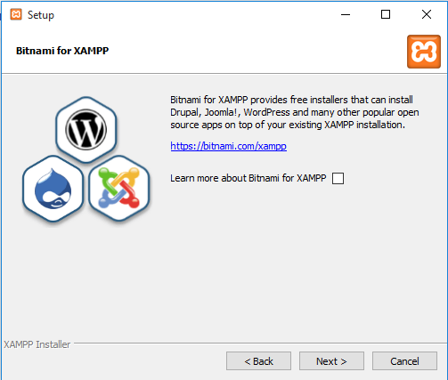

How to install and configure XAMPP on Windows 10
=================================================

* XAMPP is a free open source software that provides an easy way for web designers and developers to install the necessary components to run PHP based software like
  * **WordPress**,
  * **Drupal**,
  * **Joomla**, 
  * and others on Windows, Mac OS X, and Linux.

If you're a web developer, designer, or a person trying to get into blogging, XAMPP will save you time and frustration having to manually install and configure `Apache`, `MySQL`, `PHP`, and `Perl` on your computer to create a test environment.

In this guide, you'll learn the step-by-step instructions to install XAMPP on your computer running `Windows 10`, how to configure the software, and solve common problems.

* **Warning!** (Before install XAMPP)
  * If you have install PHP, MySQL which is relate to `localhost` => delete it
  * You shouldn't install XAMPP on Windows Server that has installed IIS
  * If you use Skype, you may need to change Skype port. Because Skype used port 80 (default webserver port) so localhost can't operate.
  * Disable firewall
  * Disable UAC (User Account Control)

# How to install XAMPP on windows 10

## Download XAMPP

You Download XAMPP from [Apache Friends](https://www.apachefriends.org/index.html)

## Install XAMPP

- After you downloaded, you double click and click `Next`

- Click `Next`

- Choose path (You must rember it). You should set it as default **c:\xampp**. Click `Next`

- Next page, uncheck the `Learn more about Bitnami for XAMPP` and click `Next` (2 times to install)

- Click `Finish` to complet the installation and to start using XAMPP Control Panel. But you should reboot machine after finished installation to avoid the state that can't restart `localhost`.

## Restart localhost

Now you go to **c:\xampp** and open **xampp-control.exe** file to start using XAMPP Control Panel.

- Choose language and click `Save`.

- XAMPP Control Panel

- Click `Start` button to run **localhost**

Now you access to website and type address **http://localhost**. You will se XAMPP introductions page as below:

# References

[1] https://pureinfotech.com/install-xampp-windows-10/

[2] https://thachpham.com/thu-thuat/cai-dat-localhost-xampp.html